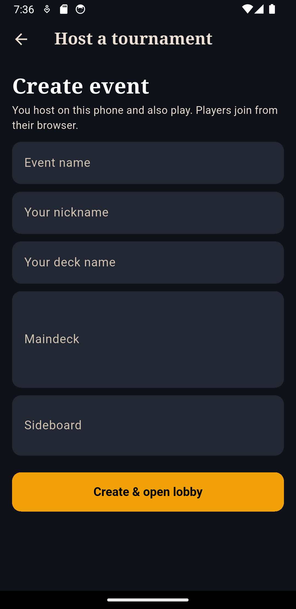

# MTG Tournament

An offline-first tournament manager for local Magic: The Gathering events. One
Android phone runs the organizer app and hosts the tournament over Wi-Fi;
players join from any modern browser by scanning a QR code, with no install and
no internet connection required during play.

<p align="center">
  
  
  
</p>

> [!WARNING]
> This is an early release intended for a trusted local network. Tournament
> traffic uses plain HTTP/WebSocket on the LAN. Do not expose port `8080` to the
> public internet or use an untrusted shared network.

## What it does

- Hosts a tournament directly from the organizer's Android phone.
- Lets players join a lightweight browser client by QR code, URL, or event code.
- Generates Swiss pairings and standings for best-of-three matches.
- Reconciles independent result submissions from both players.
- Reveals decklists after an accepted result and escalates reported infractions.
- Gives the organizer controls for disputes, drops, round advancement, and event closure.
- Stores player profiles, named decks, tournament history, and aggregate statistics locally.
- Resolves card names through Scryfall and caches images before offline play.
- Optionally backs up the app's JSON state to the user's private Google Drive app-data folder.
- Keeps hosting alive through an Android foreground service while the screen is locked.

## How it works

The Flutter app owns the authoritative tournament state and starts an embedded
`shelf` HTTP/WebSocket server on `0.0.0.0:8080`. The server exposes the REST and
realtime APIs and serves the vanilla JavaScript player client from
`assets/web/`. State is persisted as JSON on the host device after every
mutation.

```text
Organizer Android app
  ├─ Flutter host UI
  ├─ tournament engine + JSON persistence
  └─ embedded HTTP/WebSocket server
       └─ Wi-Fi/LAN → player phone browsers
```

See [Architecture](docs/ARCHITECTURE.md) for the module boundaries, data flow,
trust model, and current limitations. The fuller product specification lives in
[Requirements](docs/REQUIREMENTS.md).

## Development setup

### Prerequisites

- Flutter `3.44.2` with Dart `3.12.2`
- Android Studio or the Android SDK command-line tools
- JDK 17
- An Android device or emulator for the host UI

Check the local toolchain, fetch packages, and validate the project:

```shell
flutter --version
flutter doctor
flutter pub get
dart format --output=none --set-exit-if-changed lib test bin
flutter analyze
flutter test
```

Run the Android host app:

```shell
flutter devices
flutter run -d <device-id>
```

The host phone and player phones must be on the same Wi-Fi network. Some guest,
corporate, and public networks isolate clients from one another; use a private
router or hotspot if players cannot reach the displayed URL.

### Player-client development

The player interface has no JavaScript build step. Run the same Dart server used
by the app and open the printed URL:

```shell
dart run bin/dev_server.dart 8091
```

Edit `assets/web/app.js`, `assets/web/style.css`, or
`assets/web/index.html`, then refresh the browser.

### Android builds

For a locally installable debug APK:

```shell
flutter build apk --debug
```

Production APKs must use a private release keystore. Configure
`android/key.properties` and keep both that file and the keystore outside Git,
then run:

```shell
flutter build apk --release
```

The output is written below `build/app/outputs/flutter-apk/`.

### Optional Google Drive backup

Guest mode works without Google configuration. To enable account backup for a
signed build, create the Android OAuth client for package
`com.giuseppe.mtg.mtg_tourney` and register the signing certificate's SHA-1 in
Google Cloud. The requested Drive scope is limited to the app's private
`appDataFolder`.

## Repository layout

| Path | Purpose |
| --- | --- |
| `lib/shared/` | Models, Swiss pairing, tournament state machine, and statistics |
| `lib/server/` | REST/WebSocket server, snapshots, and JSON persistence |
| `lib/host/` | Android hosting lifecycle, foreground service, and orchestration |
| `lib/services/` | Scryfall cache and optional Google Drive integration |
| `lib/ui/` | Flutter organizer screens |
| `assets/web/` | No-build browser client served to players over the LAN |
| `bin/` | Standalone development server |
| `test/` | Unit, persistence, and in-memory HTTP regression tests |
| `docs/` | Architecture, requirements, and curated screenshots |

## Data and security

- Tournament data is stored on the organizer's device, not on a hosted backend.
- Optional cloud backup writes one JSON blob to the user's private Drive app-data folder.
- Player sessions use bearer tokens and assume a trusted LAN.
- Card lookup and image download require internet only during deck preparation;
  cached images are served locally during the event.
- Local captures, credentials, signing material, build output, and interview
  artifacts are excluded by `.gitignore`.

Security concerns should be reported according to [SECURITY.md](SECURITY.md),
without including live tokens or private tournament data in a public issue.

## Contributing

Read [CONTRIBUTING.md](CONTRIBUTING.md) before changing the tournament engine or
wire protocol. Every change should keep `dart format`, `flutter analyze`, and
`flutter test` green; GitHub Actions runs the same checks.

## Disclaimer

Magic: The Gathering is a trademark of Wizards of the Coast. This community
project is not affiliated with or endorsed by Wizards of the Coast. Card data
and images are retrieved from Scryfall when the organizer requests them.
