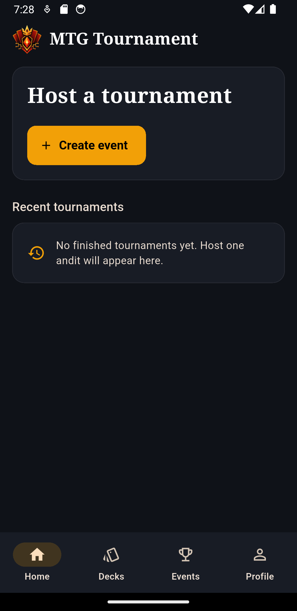
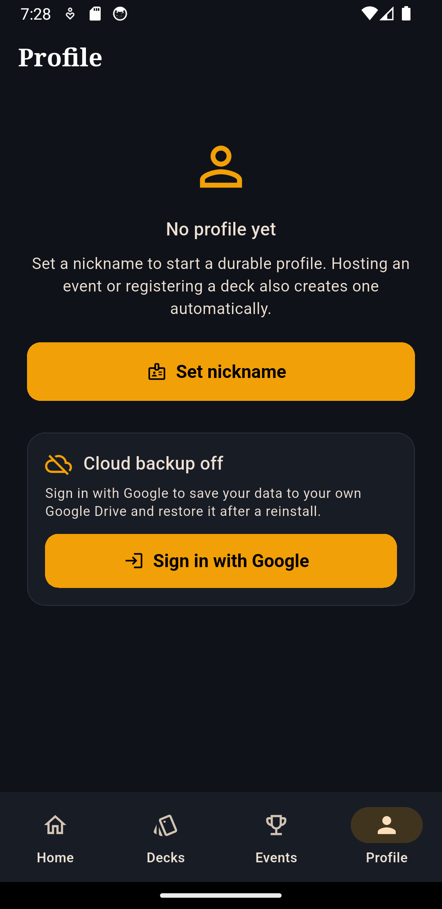

This is an app to play for friend, made for friends. It lets you organize tournaments for Magic: The Gathering events. One phone hosts the tournament and players join from any browser by
scanning a QR code. Each event can run fully online or locally on the same Wi-Fi with no internet required during play.

<p align="center">
  
  
</p>

> [!WARNING]
> LAN mode uses plain HTTP and WebSocket connections. Use it only on trusted
> networks and never expose port `8080` to the public internet.
> Online mode uses HTTPS/WSS through the included relay.

## Features

* Online and LAN tournaments.
* Browser-based player client accessible by QR code, URL, or event code.
* Swiss pairings, standings, and best-of-three matches.
* Independent result submission by both players.
* Organizer controls for disputes, drops, rounds, and event closure.
* Decklist management and card lookup through Scryfall.
* Local player profiles, tournament history, and statistics.
* Optional backup to the user's private Google Drive app-data folder.
* Export of all app data as a gzipped JSON file.
* Android foreground service to keep the tournament active while the screen is locked.

## How it works

The organizer's Android phone owns the tournament state.

```text
Organizer Android app
  ├─ Flutter organizer UI
  ├─ tournament engine and JSON persistence
  ├─ LAN: local HTTP/WebSocket server
  └─ Online: secure WebSocket connection to the Cloudflare relay
```

In LAN mode, the app starts a server on `0.0.0.0:8080` for devices connected to
the same Wi-Fi network.

In Online mode, the app connects to a Cloudflare Durable Object that relays
player commands and tournament updates. Tournament data remains stored on the
organizer's device.

For more details, see:

* [Architecture](docs/ARCHITECTURE.md)
* [Requirements](docs/REQUIREMENTS.md)

## Development

### Requirements

* Flutter `3.44.2`
* Dart `3.12.2`
* JDK 17
* Android Studio or Android SDK command-line tools
* Android device or emulator
* Node.js 22+ for the optional Cloudflare relay

### Setup

```shell
flutter doctor
flutter pub get
dart format --output=none --set-exit-if-changed lib test bin tool
flutter analyze
flutter test
```

Run the Android app:

```shell
flutter devices
flutter run -d <device-id>
```

For LAN events, all devices must be connected to the same Wi-Fi network.
Networks with client isolation may prevent players from reaching the host.

## Online relay

Online mode requires a Cloudflare deployment and a build configured with its
public URL.

```shell
cd cloudflare
npm ci
npm run check
```

See [Online hosting setup](docs/ONLINE_HOSTING.md) for deployment instructions.

Cloudflare credentials are used only by Wrangler on the developer machine and
must not be committed to the repository.

## Player client

The browser client has no build step.

Start the development server:

```shell
dart run bin/dev_server.dart 8091
```

Then edit:

* `assets/web/app.js`
* `assets/web/style.css`
* `assets/web/index.html`

Refresh the browser to see the changes.

## Android builds

Build a debug APK:

```shell
flutter build apk --debug
```

Build a release APK:

```shell
flutter build apk --release
```

Release builds require a private keystore configured in
`android/key.properties`. Never commit the keystore or its credentials.

Generated APKs are available under:

```text
build/app/outputs/flutter-apk/
```

## Google Drive backup

Google Drive backup is optional. Guest mode works without Google configuration.

To enable backup, configure an Android OAuth client for:

```text
com.giuseppe.mtg.mtg_tourney
```

The app only requests access to its private Drive `appDataFolder`.

See [Google sign-in and Drive backup setup](docs/GOOGLE_SIGN_IN.md) for setup and
troubleshooting instructions.

## Repository structure

| Path            | Purpose                                            |
| --------------- | -------------------------------------------------- |
| `lib/shared/`   | Models, pairings, tournament logic, and statistics |
| `lib/server/`   | HTTP/WebSocket server and persistence              |
| `lib/host/`     | LAN and Online hosting lifecycle                   |
| `lib/services/` | Scryfall and Google Drive integrations             |
| `lib/ui/`       | Flutter organizer interface                        |
| `assets/web/`   | Browser player client                              |
| `cloudflare/`   | Online relay                                       |
| `bin/`          | Development server                                 |
| `test/`         | Automated tests                                    |
| `docs/`         | Documentation and screenshots                      |

## Data and security

* Tournament data is stored on the organizer's device.
* The online relay does not permanently store tournament data.
* Online traffic uses HTTPS/WSS.
* LAN mode should only be used on trusted networks.
* Scryfall card lookup requires internet during deck preparation.
* Cached card images can be served locally during LAN events.
* Credentials, signing files, build output, and local data are excluded by
  `.gitignore`.

Report security issues according to [SECURITY.md](SECURITY.md). Do not include
tokens, credentials, or private tournament data in public issues.

## Contributing

Read [CONTRIBUTING.md](CONTRIBUTING.md) before changing the tournament engine or
network protocol.

Before submitting a change, run:

```shell
dart format --output=none --set-exit-if-changed lib test bin tool
flutter analyze
flutter test
```

Changes to the relay or browser client must also pass the Cloudflare checks.

## Credits

* Antonio Rossi

## Disclaimer

Magic: The Gathering is a trademark of Wizards of the Coast.

This community project is not affiliated with or endorsed by Wizards of the
Coast. Card data and images are retrieved from Scryfall.
